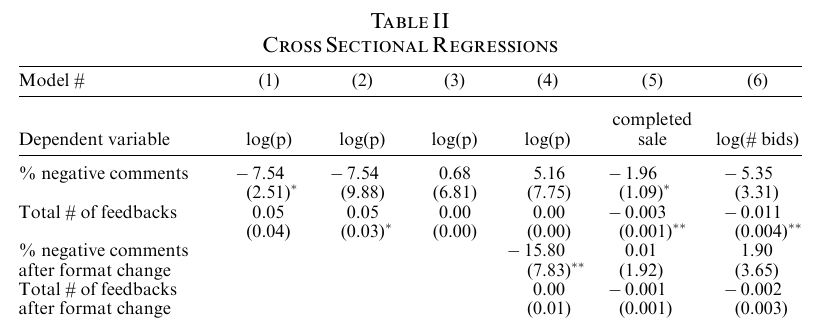
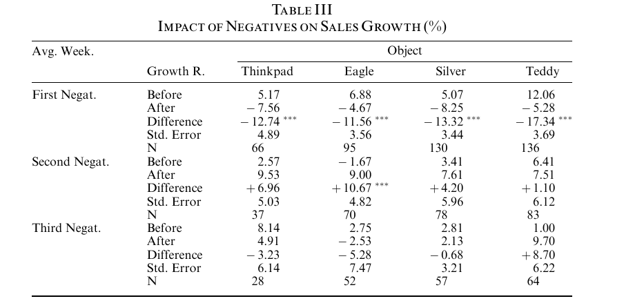
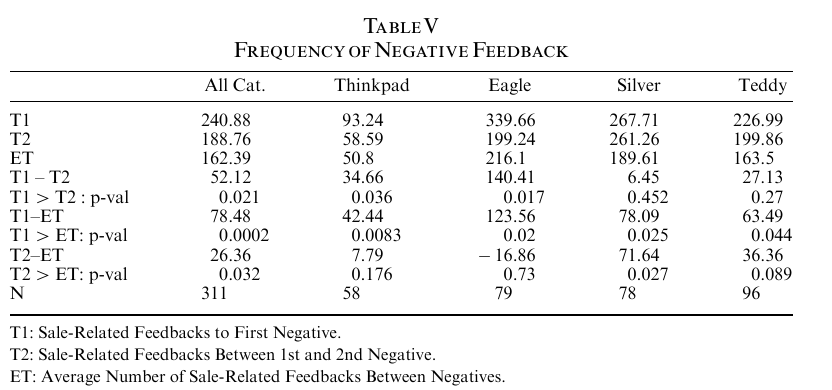
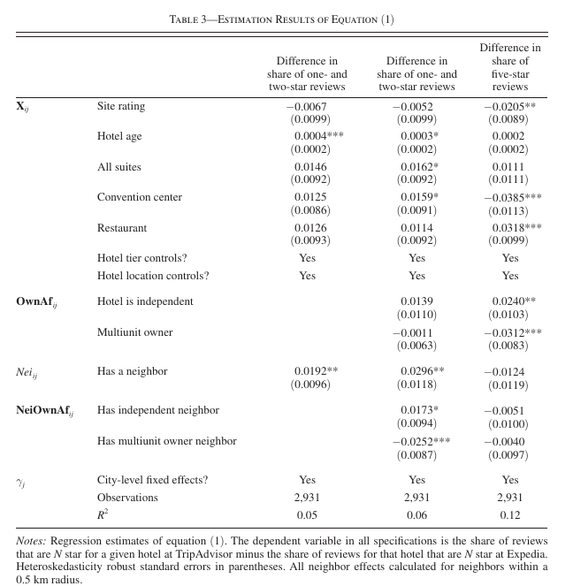

class: font200

# Learning Goals for this Week

TBD

---
class: inverse, center, middle

# Online Reputation Matters


---
# Online Reputation Effects Perceptions

something

---
# Online Reputation Effects Sales

something

---
# Why Online Reputation Matters

Buyers need to trust sellers

* Product descriptions
* Fulfilling transactions 

Sellers need to trust buyers 

* Ensure buyer will pay
* Abide by terms of service

Where does this trust come from?

$\implies$ **reputation systems** 

... and design choices made by a marketplace

---
# What do we want to know?


... and much more

* But there's a fixed amount of time here 


---
class: inverse, center, middle

# Dynamics of Seller Reputation

---
# Seller Reputation in the Online Marketplace 

**Motivation**: Reputation mechanisms allow consumers to monitor firms

* How do consumers respond to changes in seller reputation?

**Specific Questions**: What is the effect of reputation on:

* Price / Willingness to Pay
* Sales Growth
* Subsequent reviews

Following discussion based on [Cabral & Hortascu, 2010][cabral]

[cabral]: https://onlinelibrary.wiley.com/doi/10.1111/j.1467-6451.2010.00405.x

---
# Empirical Approach

**Data**: eBay, follow sellers of five homogenous products

* Transaction level data 
* Seller's sequence of reviews

**Empirical Approach**:

* Descriptive Regressions
* Differences in Means

**None** of the effects we discuss here are **causal**

* Think of the results as descriptive associations between two variables

---
# Reputation & Price

**Estimating Equation**:

$$
price = \beta ( \text{reputation_measure} ) +
        \gamma( \text{other demand factors} ) +
        \text{error}
$$

**Excerpt fo Table 2**:

```{r, echo = FALSE, fig.align = "center", out.width="90%"}

```

---
# Negative Feedback & Sales Growth

**Metric**: Difference in Sales Growth before / after first negative feedback

```{r, echo = FALSE, fig.align = "center", out.width="90%"}

```

---
# Frequency of Negative Feedback

**Metric**: Frequency of Arrival of Negative Feedback

```{r, echo = FALSE, fig.align = "center", out.width="90%"}

```

---
# Managerial Implications

1. Price / Willingess to Pay is not the main metric through which decreases in reputation operates
2. Quantity sold is an important metric
  * Sales decrease with negative feedback 
3. Negative Feedback can generate more negative feedback
  * Though authors argue this is moral hazard - less effort by sellers

---
class: inverse, center, middle

# Online Review Manipulation

---
# Reputation Manipulation 

**Motivation**: Reputation is most useful when it's not tainted by "fake reviews"

* Fake reviews lead to:
  * Lower consumer welfare through suboptimal choices 
  * Mistrust in online reviews and reputation

**Question**: When does review manipulation occur?

* Are there more fake reviews when competition is close by?
* Do smaller hotels try to boost their reputation?
  * More positive fake reviews for small hotels?
  * More negative reviews for competitor nearby a small hotel?

Following discussion based on [Mayzlin, Dover and Chevalier, 2014][mayzlin]

[mayzlin]: https://pubs.aeaweb.org/doi/pdfplus/10.1257/aer.104.8.2421

---
# Empirical Approach

**Data**: Travel sites in the US - TripAdvisor & Expedia
  * Star Ratings of all reviews for all hotels in subset of cities in the US
  * Supplement with hotel industry data from Smith Travel Research

**Empirical Approach**: 'akin to Difference in Differences'

* But not DiD in a 'standard sense'


* **What makes all this work**:
  * Trip Advisor: Anyone can post at anytime
  * Expedia: Can only post if booked on Expedia and stayed one night in last 6 months
  * $\implies$ fake reviews are harder to post on Expedia
  * **Assumption**: Users on each platform value hotel characteristics equally

---
# Regression Equation

Estimate the following equation:

$$
\begin{equation}
y_{ij} = X_{ij} B_1 + 
   \text{OwnAf}_{ij} B_2 +
   \text{Nei}_{ij} B_3+
   \text{NeiOwnAf}_{ij} B_4 +
   \sum \gamma_j + 
   \varepsilon_{ij}
\end{equation}
$$

Notation:

* $i$ hotels, $j$ city
* $y_{ij}$ Difference in share of $N$ star reviews between Trip Advisor and Expedia 
* $X_{ij}$ are hotel characteristics
* $\text{Nei}_{ij}$ = 1 if competitor hotel within 0.5 km, else zero
  * We care about these coefficients, $B_3$
* $\text{OwnAf}_{ij}$ are hotel ownership characteristics
  * We care about these coefficents ($B_2$)
* $\text{NeiOwnAf}_{ij}$ are competitor hotels ownership characteristics
  * We care about these coefficents ($B_4$)

---
# Why this approach will work ...

Authors don't observe review manipulation directly $\implies$ infer it from data patterns

* It's easier to manipulate reviews on TripAdvisor...

The story goes something like this:

* If the fraction of low (high) reviews on Trip Advisor is larger than on Expedia 
* And consumers value the hotel equally between platforms 
* Then differences are likely due to review manipulation on Trip Advisor 

So let's check out the results...

---
# Main Results

```{r, echo = FALSE, fig.align = "center", out.width="67%"}

```

---
# Interpreting Results

Column 1:

* $B_3$: 0.0192 $\implies$ hotels with a neighbouring competitor have a 1.9 percentage point increase in share of bad reviews
  * approx. 7.5 percent increase compared to the baseline of 25 percent bad reviews

Column 2: 

* $B_3 + B_4$: $\implies$  hotels with an independent hotel as a  neighbouring competitor have a 4.7 percentage point increase in share of bad reviews
  * approx. 20 percent increase compared to the baseline of 25 percent bad reviews  

Column 3: 

* $B_2$: $\implies$  independent hotels have a 3.4 percentage point increase in share of positive reviews
  * approx. 7.5 percent increase compared to the baseline of 31 percent five star reviews

---
# Takeaways

1. Hotels with neighbors have more negative reviews
  * Suggestive of competitors giving each other negative fake reviews

2. If neighbor is an independent hotel, (1) is even more likely 

3. Independent hotels have higher reviews
  * Suggestive of positive review manipulation
  * But there are competing stories

**Punchline**: evidence for fake reviews and manipulating online reputation
  * Either by competitors (negative) or by the firm itself (positive)

**Marketing Implications?**

* More for platform owners ...
* There's a need to try and monitor / control reviews

---
class: inverse, center, middle

# Managerial Response to Online Reviews

---
# Managerial Reviews & Reputation 

**Motivation**: Business increasingly proactive to managing reputation

**One Approach**: Managerial Responses

**Question**: What is the effectiveness of Managerial Responses on future reviews?

* Are there more or less? $\implies$ volume effects
* Are the more or less positive $\implies$ valence effects

Following discussion based on [Chen et al, 2019][chen-etal]

[chen-etal]: https://repository.arizona.edu/bitstream/handle/10150/632181/2%20ISR-MR-Paper.pdf?sequence=1

---
# Empirical Approach: Natural Experiment

**Data**: Travel Agencies in China (two): Ctrip & eLong

**Empirical Approach**: Difference-in-Difference-in-Differences

* This is an extension of the Difference in Differences idea we've seen before

* **What makes all this work**: Ctrip introduces managerial response, eLong does not

---
# Difference-in-Difference-in-Differences

Why an extra difference? Let's think intuitively...

* Assume only two periods, 1 and 2
* Ctrip ($C$) allows managerial response in period 2, eLong ($E$) does not
* $\bar{y}_{i,j}$ = average number of reviews on platform $i$ in period $j$

**Difference in Differences**:

* Difference in average volume between 2 periods across different platforms:

$$
\begin{equation}
\hat{\beta}_{DiD} =  (\bar{y}_{C,2} - \bar{y}_{C,1}) - (\bar{y}_{E,2} - \bar{y}_{E,1})
\end{equation}
$$

* Assumes that hotels that decide to use managerial response on Ctrip are not different to those who don't adopt it
  * "No inherent (managerial) quality difference"
  * If there is, it will make estimates of the treatment effect **biased**

Why are we worrying about this?

* Hotels can self select into whether they adopted Managerial Responses on Ctrip
  * And those that do might be systematically different than non-adopters
  * Self selection is *always* a worry when we want causality

---
# Difference-in-Difference-in-Differences

* Some more notation:
  * Let $A$ denote hotels that adopt managerial responses on Ctrip
  * Let $N$ denote hotels that do not adopt managerial responses on Ctrip

*Note*: We observe reviews of both types of hotels on both platforms!

**Difference-in-Difference-in-Differences**

* Difference in differences of average volumes between 2 periods and each hotel "type" across different platforms

$$
\begin{align}
\hat{\beta}_{DDD} &= [ (\bar{y}_{C,A,2} - \bar{y}_{C,A,1}) - (\bar{y}_{C,N,2} - \bar{y}_{C,N,1})] \\
     &- [ (\bar{y}_{E,A,2} - \bar{y}_{E,A,1}) - (\bar{y}_{E,N,2} - \bar{y}_{E,N,1})]
\end{align}
$$

We've "subtracted out" the differences in managerial quality

---
# Regression Equation

How do the authors do that as a regression?

$$
\begin{equation}
\Delta Y_{it} = 
   \gamma MR_i +
   \beta MR_{i} \times After_{it} + 
   \delta ' X_{it} + 
   \alpha_i + 
   \theta_t +
   \varepsilon_{it}
\end{equation}
$$

* $\beta$ is the treatment effect $\implies$ this is the (only) number we care about

The 'extra' difference is in the use of $\Delta Y_{it}$ rather than $Y_{it}$

  * Not a 'totally standard' way of doing it, but it works

---
# Main Results - Impact on Volume, not Valence

```{r, echo = FALSE, fig.align = "center", out.width="90%"}
knitr::include_graphics("figs/mr_main_result.png")
```

Interpretation:

* Specification (3) and (6) are the richest
* On average, 12.3% increase in monthly volume after adopting managerial responses 

---
# Target & Style of Managerial Response


```{r, echo = FALSE, fig.align = "center", out.width="65%"}
knitr::include_graphics("figs/mr_length_result.png")
```

Main Takeaways:

* Short Responses to Positive Reviews to not distract consumers
* Longer Responses to Negative Reviews to mitigate concerns 

---
class: inverse, center, middle

# Recap

---
# Summary

---
# License & Citation

Suggested Citation:

```{r, engine='out', eval = FALSE}
@misc{smwa-lecture-02,
      title={"Social Media and Web Analytics: Lecture 02 - Online Reputation"},
      author={Lachlan Deer},
      year={2021},
      url = "https://github.com/tisem-digital-marketing/smwa-lecture-02"
}
```

<p style="text-align:center;"></p>

This course adheres to the principles of the Open Science Community of Tilburg University. 
This initiative advocates for transparency and accessibility in research and teaching to all levels of society and thus creating more accountability and impact.

<p style="text-align:center;"></p>
This work is licensed under a <a rel="license" href="http://creativecommons.org/licenses/by-sa/4.0/">Creative Commons Attribution-ShareAlike 4.0 International License</a>.