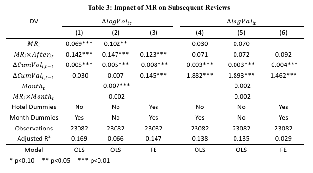
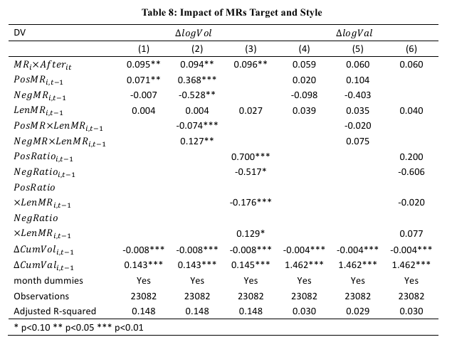

class: font200

# Learning Goals for this Week

TBD

---
class: inverse, center, middle

# Online Reputation Matters


---
# Online Reputation Effects Perceptions

something

---
# Online Reputation Effects Sales

something

---
# Why Online Reputation Matters

Buyers need to trust sellers

* Product descriptions
* Fulfilling transactions 

Sellers need to trust buyers 

* Ensure buyer will pay
* Abide by terms of service

Where does this trust come from?

$\implies$ **reputation systems** 

... and design choices made by a marketplace

---
# What do we want to know?


... and much more

* But there's a fixed amount of time here 


---
class: inverse, center, middle

# Dynamics of Seller Reputation

---
# Slide Title 

course content here

---
# Reputation & Price

Estimating Equation:

$$
price = \beta ( \text{reputation_measure} ) +
        \gamma( \text{other demand factors} ) +
        \text{error}
$$

Results

(Table 2) 

---
# Negative Feedback & Sales Growth

Metric: Difference in Sales Growth before / after first negative feedback

(Table 3)

---
# Frequency of Negative Feedback

Metric: Frequency of Arrival of Negative Feedback

---
# Managerial Implications

1. Price / Willingess to Pay is not the main metric through which decreases in reputation operates
2. Quantity sold is an important metric
  * Sales decrease with negative feedback 
3. Negative Feedback can generate more negative feedback
  * Though authors argue this is moral hazard - less effort by sellers

---
class: inverse, center, middle

# Reputation and Review Fraud

---
# Slide Title 

course content here

---
# Main Takeaways

---
class: inverse, center, middle

# Managerial Response to Online Reviews

---
# Managerial Reviews & Reputation 

**Motivation**: Business increasingly proactive to managing reputation

**One Approach**: Managerial Responses

**Question**: What is the effectiveness of Managerial Responses on future reviews?

* Are there more or less? $\implies$ volume effects
* Are the more or less positive $\implies$ valence effects

Following discussion based on [Chen et al, 2019][chen-etal]

[chen-etal]: https://repository.arizona.edu/bitstream/handle/10150/632181/2%20ISR-MR-Paper.pdf?sequence=1

---
# Empirical Approach

**Data**: Travel Agencies in China (two): Ctrip & eLong

**Empirical Approach**: Difference-in-Difference-in-Differences

* This is an extension of the Difference in Differences idea we've seen before

* **What makes all this work**: Ctrip introduces managerial response, eLong does not

---
# Difference-in-Difference-in-Differences

Why an extra difference? Let's think intuitively...

* Assume only two periods, 1 and 2
* Ctrip ($C$) allows managerial response in period 2, eLong ($E$) does not
* $\bar{y}_{i,j}$ = average number of reviews on platform $i$ in period $j$

**Difference in Differences**:

* Difference in average volume between 2 periods across different platforms:

$$
\begin{equation}
\hat{\beta}_{DiD} =  (\bar{y}_{C,2} - \bar{y}_{C,1}) - (\bar{y}_{E,2} - \bar{y}_{E,1})
\end{equation}
$$

* Assumes that hotels that decide to use managerial response on Ctrip are not different to those who don't adopt it
  * "No inherent (managerial) quality difference"
  * If there is, it will make estimates of the treatment effect **biased**

Why are we worrying about this?

* Hotels can self select into whether they adopted Managerial Responses on Ctrip
  * And those that do might be systematically different than non-adopters
  * Self selection is *always* a worry when we want causality

---
# Difference-in-Difference-in-Differences

* Some more notation:
  * Let $A$ denote hotels that adopt managerial responses on Ctrip
  * Let $N$ denote hotels that do not adopt managerial responses on Ctrip

*Note*: We observe reviews of both types of hotels on both platforms!

**Difference-in-Difference-in-Differences**

* Difference in differences of average volumes between 2 periods and each hotel "type" across different platforms

$$
\begin{align}
\hat{\beta}_{DDD} &= [ (\bar{y}_{C,A,2} - \bar{y}_{C,A,1}) - (\bar{y}_{C,N,2} - \bar{y}_{C,N,1})] \\
     &- [ (\bar{y}_{E,A,2} - \bar{y}_{E,A,1}) - (\bar{y}_{E,N,2} - \bar{y}_{E,N,1})]
\end{align}
$$

We've "subtracted out" the differences in managerial quality

---
# Regression Equation

How do the authors do that as a regression?

$$
\begin{equation}
\Delta Y_{it} = 
   \gamma MR_i +
   \beta MR_{i} \times After_{it} + 
   \delta ' X_{it} + 
   \alpha_i + 
   \theta_t +
   \varepsilon_{it}
\end{equation}
$$

* $\beta$ is the treatment effect $\implies$ this is the (only) number we care about

The 'extra' difference is in the use of $\Delta Y_{it}$ rather than $Y_{it}$

  * Not a 'totally standard' way of doing it, but it works

---
# Main Results - Impact on Volume, not Valence

```{r, echo = FALSE, fig.align = "center", out.width="90%"}

```

Interpretation:

* Specification (3) and (6) are the richest
* On average, 12.3% increase in monthly volume after adopting managerial responses 

---
# Target & Style of Managerial Response


```{r, echo = FALSE, fig.align = "center", out.width="65%"}

```

Main Takeaways:

* Short Responses to Positive Reviews to not distract consumers
* Longer Responses to Negative Reviews to mitigate concerns 

---
class: inverse, center, middle

# Recap

---
# Summary

---
# License & Citation

Suggested Citation:

```{r, engine='out', eval = FALSE}
@misc{smwa-lecture-02,
      title={"Social Media and Web Analytics: Lecture 02 - Online Reputation"},
      author={Lachlan Deer},
      year={2021},
      url = "https://github.com/tisem-digital-marketing/smwa-lecture-02"
}
```

<p style="text-align:center;"></p>

This course adheres to the principles of the Open Science Community of Tilburg University. 
This initiative advocates for transparency and accessibility in research and teaching to all levels of society and thus creating more accountability and impact.

<p style="text-align:center;"></p>
This work is licensed under a <a rel="license" href="http://creativecommons.org/licenses/by-sa/4.0/">Creative Commons Attribution-ShareAlike 4.0 International License</a>.